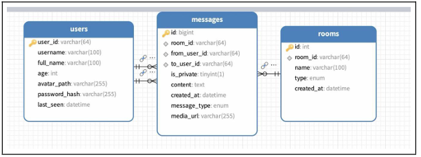
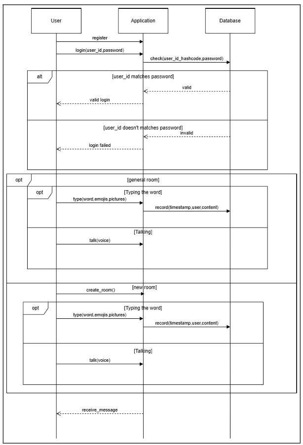
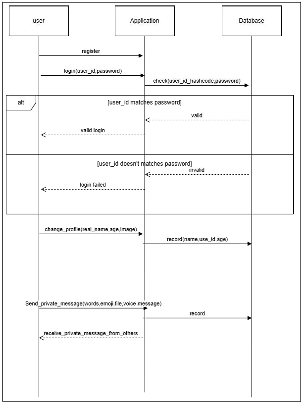
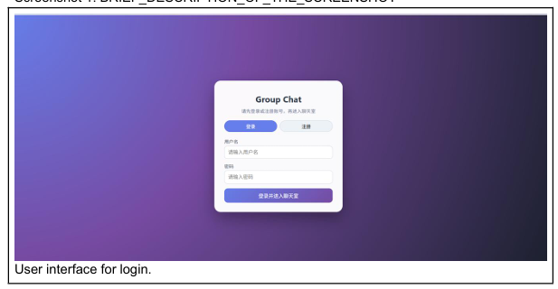
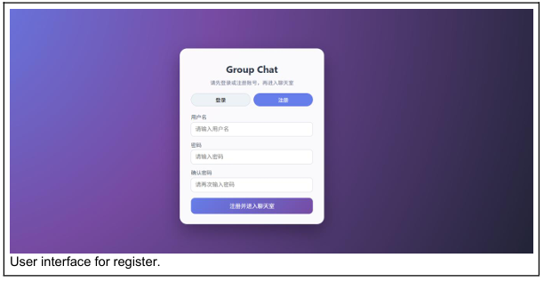
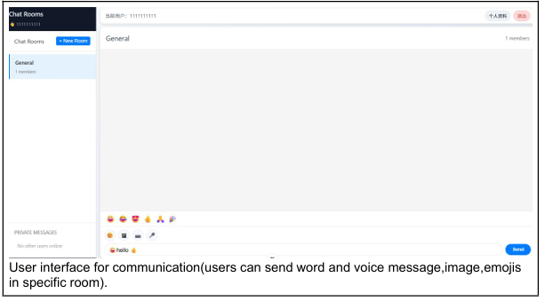
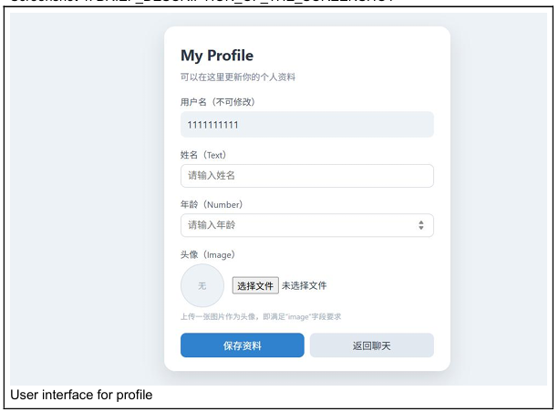

# Real-Time Chat System

A full-stack real-time chat product prototype built with **Vue 3, Node.js, Express, Socket.IO, and MySQL**.
The project is designed around real-time communication scenarios and supports **public chat, private chat, room management, user profiles, avatar upload, and media message upload**.

---

## Project Overview

This project aims to build a complete real-time chat system from both **product design** and **technical implementation** perspectives.
Instead of only focusing on front-end pages or back-end APIs, the project was designed as a full communication system with clear user flow, functional modules, and state transitions.

The system covers:
- User registration and login
- Public chat room
- Private messaging
- Room creation and switching
- Online user status
- User profile editing
- Avatar upload
- Image / audio / sticker message upload

---

## Core Features

### 1. User System
- User registration and login
- Password encryption with bcryptjs
- User profile retrieval and update
- Avatar upload

### 2. Real-Time Messaging
- Public room chat
- Private one-to-one chat
- Real-time message synchronization using Socket.IO
- Text, image, audio, and sticker message support

### 3. Room Management
- Default public room
- Custom room creation
- Room switching
- Room member synchronization

### 4. Profile & Media
- User avatar upload
- Chat image and audio upload
- Built-in sticker messages

---

## Local Setup

1. Create the MySQL database and tables:
   ```bash
   mysql -u root -p < backend/schema.sql
   ```

2. Configure backend environment variables:
   ```bash
   cp backend/.env.example backend/.env
   ```

3. Configure frontend environment variables:
   ```bash
   cp frontend/.env.example frontend/.env.local
   ```

4. Start the backend:
   ```bash
   cd backend
   npm install
   npm run dev
   ```

5. Start the frontend:
   ```bash
   cd frontend
   npm install
   npm run dev
   ```

---

## Website Deployment

The frontend demo is published with GitHub Pages:

```text
https://jackycui419.github.io/realtime-chat-system/
```

Without a public backend URL, the site runs in local demo mode: registration, login, room creation, profile editing, and messages are stored in the current browser for portfolio demonstration.

The site is served from the `gh-pages` branch. To rebuild the static frontend locally:

```bash
cd frontend
npm run build:pages-demo
```

### Backend Requirement

The GitHub Pages link only hosts the Vue frontend. Real-time chat also needs the Node.js backend and MySQL database to be available on the public internet.

Deploy the backend with any Node/Docker hosting platform, then rebuild the frontend with:

```text
VITE_API_BASE_URL=https://your-backend-domain.com
VITE_SOCKET_URL=https://your-backend-domain.com
```

The backend expects these environment variables:

```text
PORT=3000
DB_HOST=your-mysql-host
DB_USER=your-mysql-user
DB_PASSWORD=your-mysql-password
DB_NAME=chat_app
FRONTEND_URL=https://jackycui419.github.io/realtime-chat-system
```

## Database Schema

The database schema was designed to support users, chat rooms, and message storage.



---

## Use Cases / User Flow

### Public Chat and Room Interaction


### Private Messaging and Profile Update


---

## Screenshots

### Login Page


### Registration Page


### Main Chat Interface


### Profile Page

